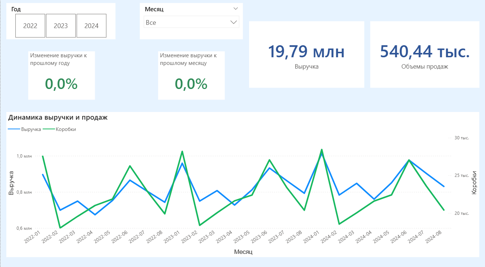
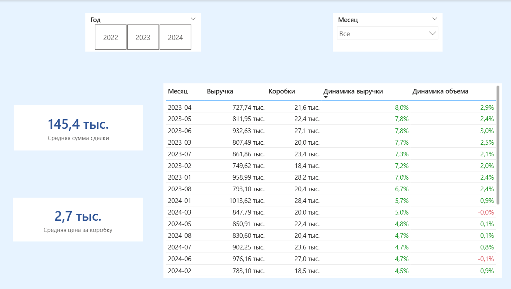
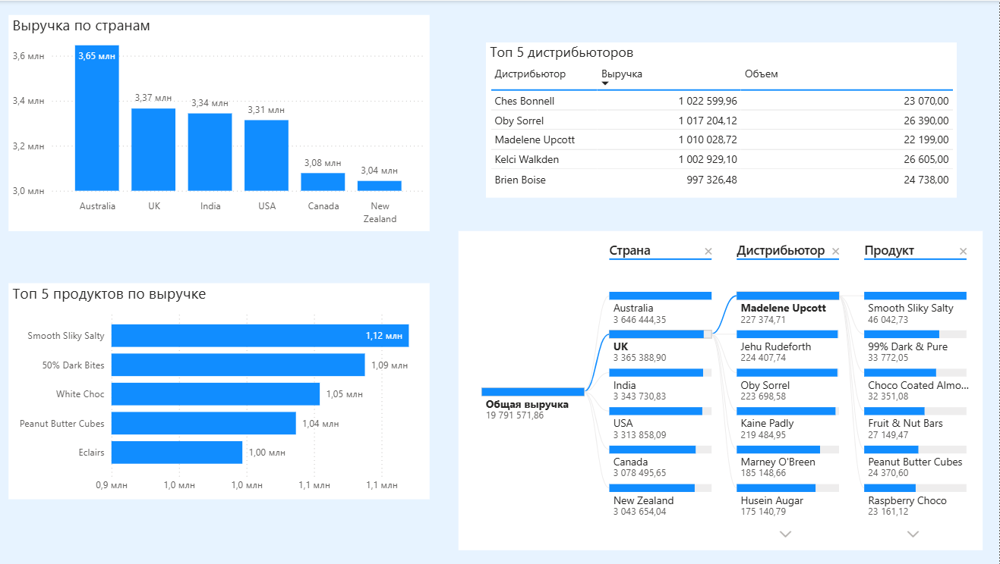

# Дашборд продаж шоколада (Power BI)

## Обзор проекта
End-to-end аналитический проект, посвященный анализу мировых продаж шоколада за период 2022-2024 гг.

Проект охватывает полный цикл аналитики данных:
- Поиск и загрузка исходных данных из Kaggle
- Очистка, трансформация и агрегация данных с использованием SQL (MySQL Workbench)
- Подготовка аналитической модели
- Разработка интерактивного дашборда в Power BI

---

## Данные
- Источник: открытый датасет продаж шоколада (Kaggle)
- Исходный формат: CSV
- Обработка данных: SQL (MySQL Workbench)
- Агрегированный и подготовленный слой данных загружен в Power BI

---

## Ключевые метрики
- Общая выручка (Total Revenue)
- Изменение выручки год к году (YoY %)
- Изменение выручки месяц к месяцу (MoM %)
- Количество отгруженных коробок (Boxes Shipped)
- Средний размер сделки (Average Deal Size)

---

## Использованные техники
- Star schema для модели данных
- DAX-меры для расчета YoY и MoM
- KPI-карточки
- Top-N анализ
- Decomposition Tree
- Интерактивные срезы по году и месяцу

---

## Инструменты
- Power BI Desktop
- SQL (MySQL Workbench)
- DAX

---

## Превью дашборда
### Executive Overview

### Sales Breakdown

### Decomposition Tree

